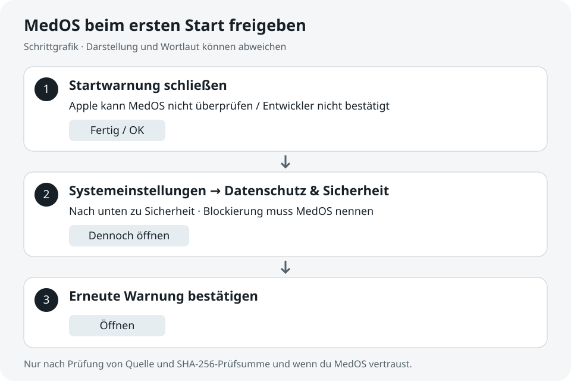

# Installation und Updates

Lade Dateien ausschließlich aus den Releases dieses Repositorys. Die Datei `SHA256SUMS` enthält die Prüfsummen. Unter macOS: `shasum -a 256 DATEI`. Unter Windows PowerShell: `Get-FileHash DATEI -Algorithm SHA256`. Vergleiche die gesamte ausgegebene Prüfsumme mit dem zugehörigen Eintrag.

## macOS

MedOS ist derzeit nicht von Apple beglaubigt. Deshalb kann macOS den ersten Start blockieren. Die Freigabe erfolgt in den Systemeinstellungen, bevor die App ihre Einführung anzeigen kann.

### 1. Installieren

Lade die **DMG** für deinen Mac aus den [Releases](../../../releases): `darwin-aarch64` für Apple Silicon (M1 oder neuer), `darwin-x86_64` für Intel. Die `.app.tar.gz`-Dateien sind für den Updater. Prüfe den Download wie oben beschrieben.

Öffne die DMG und ziehe **MedOS** auf **Applications / Programme**. Öffne danach MedOS im Ordner Programme.

*Ziehe das MedOS-Symbol auf den Ordner. Die Anordnung kann je nach macOS-Version abweichen.*

### 2. Wenn macOS den Start blockiert

Bei einer Meldung über einen nicht bestätigten Entwickler oder eine fehlende Prüfung durch Apple: Schließe die Meldung mit **Fertig** bzw. **OK**. Öffne **Systemeinstellungen → Datenschutz & Sicherheit** und scrolle zum Abschnitt **Sicherheit**.

*Hier erscheint nach einem blockierten Start die Freigabe für MedOS. Auf dem abgebildeten Mac war MedOS bereits freigegeben; deshalb fehlt der Button.*

### 3. Nur MedOS freigeben

Prüfe, dass die Blockierung **MedOS** nennt. Wenn Quelle und Prüfsumme stimmen und du der App vertraust, wähle **Dennoch öffnen**. Bestätige anschließend den Dialog mit **Öffnen**. Eine angeforderte Bestätigung mit Passwort oder Touch ID erfolgt direkt in macOS.

*Schrittgrafik, kein Screenshot. Wortlaut und Darstellung unterscheiden sich zwischen macOS-Versionen.*

Danach kannst du MedOS wie gewohnt aus Programme öffnen. Die Freigabe bleibt für diese App gespeichert.

### Wenn es nicht klappt

- **„Dennoch öffnen“ fehlt:** Versuche zuerst, MedOS aus Programme zu öffnen, und kehre dann zu den Einstellungen zurück. Startet MedOS schon, ist keine weitere Freigabe nötig. Auf verwalteten Macs kann die IT die Freigabe einschränken.
- **„Beschädigt“ oder „wird deinen Computer beschädigen“:** Folge dieser Freigabe-Anleitung nicht. Lade die Datei erneut aus dem offiziellen Release, prüfe die Prüfsumme und melde die genaue Warnung, falls sie bleibt.
- Schalte Gatekeeper nicht global aus und entferne keine Quarantäne per Terminal.

Der Freigabeweg folgt [Apples Anleitung zum sicheren Öffnen von Apps](https://support.apple.com/de-de/102445). Die Updater-Signatur ist unabhängig von der Apple-Beglaubigung.

## Windows

Starte den EXE-Installer und folge seinen Schritten. Da MedOS ohne Windows-Signatur erscheint, kann SmartScreen eine Warnung zeigen. Nach Prüfung von Quelle und Prüfsumme kannst du, sofern Windows diese Option anbietet, über Weitere Informationen → Trotzdem ausführen fortfahren. Unternehmensrichtlinien können dies untersagen.

## Updates

Mit aktivierter automatischer Updateprüfung sucht MedOS beim Start im Kanal der installierten Version: alpha, beta oder stable. Die Installation startet erst nach deiner Auswahl von „Installieren und neu starten“ im Update-Hinweis. Speichere vorher deine Arbeit. Manuell suchst du unter Einstellungen → Über MedOS → Nach Updates suchen.

Fehlende Netzwerkverbindung, ein noch nicht veröffentlichter Kanal oder eine ungültige Signatur können ein Update verhindern. Eine fehlgeschlagene Prüfung ist keine Bestätigung, dass die installierte Version aktuell ist. Lade bei Problemen den passenden Installer aus den Releases. Ein Wechsel des Kanals erfolgt durch die bewusste Installation einer Version dieses Kanals.
