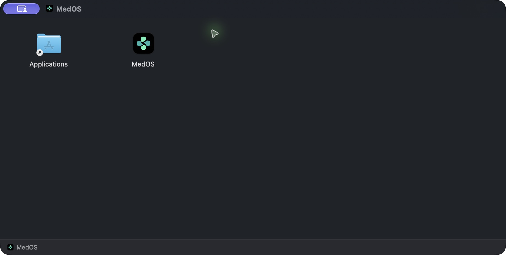
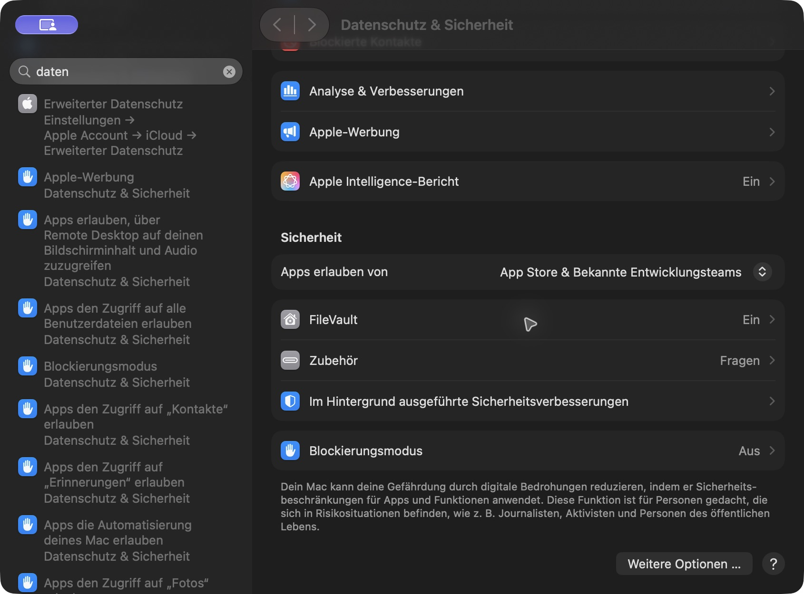

# Installation und Updates

## macOS

### 1. MedOS installieren

Lade in den [Releases](../../../releases) die DMG-Datei für deinen Mac:

- **Apple Silicon (M1 oder neuer):** `darwin-aarch64`
- **Intel:** `darwin-x86_64`

Welchen Mac du hast, siehst du unter  → Über diesen Mac.

Öffne die DMG und ziehe **MedOS** auf den Ordner **Applications**.

### 2. MedOS zum ersten Mal öffnen

Öffne MedOS im Ordner Programme. Beim ersten Start meldet macOS, dass MedOS nicht überprüft werden kann. Das liegt daran, dass MedOS nicht über Apple verteilt wird. Klicke auf **Fertig**.

### 3. MedOS erlauben

Öffne **Systemeinstellungen → Datenschutz & Sicherheit** und scrolle nach unten zu **Sicherheit**. Dort steht jetzt ein Hinweis zu MedOS. Klicke auf **Dennoch öffnen** und bestätige mit deinem Passwort oder Touch ID.

Fertig. Ab jetzt startet MedOS ganz normal, auch nach Updates.

**Kein „Dennoch öffnen“ zu sehen?** Öffne MedOS noch einmal aus dem Ordner Programme und schau danach erneut in die Einstellungen.

## Windows

Starte den Installer aus den [Releases](../../../releases). Zeigt Windows „Der Computer wurde durch Windows geschützt“, klicke auf **Weitere Informationen** und dann auf **Trotzdem ausführen**.

## Updates

Mit aktivierter automatischer Updateprüfung sucht MedOS beim Start im Kanal der installierten Version: alpha, beta oder stable. Die Installation startet erst nach deiner Auswahl von „Installieren und neu starten“ im Update-Hinweis. Speichere vorher deine Arbeit. Manuell suchst du unter Einstellungen → Über MedOS → Nach Updates suchen.

Fehlende Netzwerkverbindung, ein noch nicht veröffentlichter Kanal oder eine ungültige Signatur können ein Update verhindern. Eine fehlgeschlagene Prüfung ist keine Bestätigung, dass die installierte Version aktuell ist. Lade bei Problemen den passenden Installer aus den Releases. Ein Wechsel des Kanals erfolgt durch die bewusste Installation einer Version dieses Kanals.
